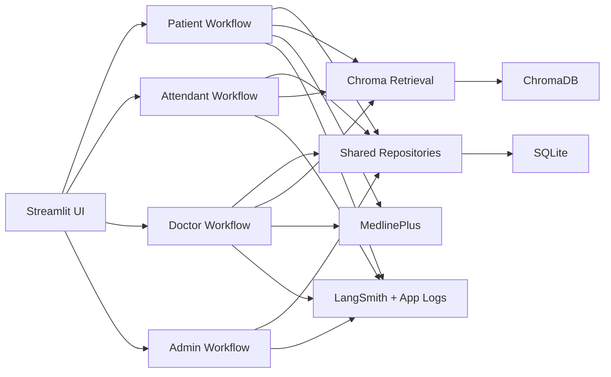

# Solution Design

## 1. Overview

The current solution is a refactored role-based healthcare assistant prototype organized around four dedicated actor workflows instead of a single shared graph.

Core building blocks:

- Streamlit UI for the demo application
- SQLite for transactional and observability persistence
- ChromaDB for semantic retrieval over patient summaries and historical medical records
- MedlinePlus for approved external medical-information enrichment
- OpenAI embeddings using `text-embedding-3-small`
- LangSmith-aware tracing plus locally persisted planner and interaction logs

This architecture favors clarity, debuggability, and actor-specific behavior over generic routing.

## 2. Runtime Architecture

## 3. Main Code Structure

### UI

- [app.py](G:/workspace/playground/healthcare-assistant/app.py)
- [streamlit_app.py](G:/workspace/playground/healthcare-assistant/app/ui/streamlit_app.py)
- [components.py](G:/workspace/playground/healthcare-assistant/app/ui/components.py)

### Actor workflows

- [patient workflow](G:/workspace/playground/healthcare-assistant/app/workflows/patient/workflow.py)
- [attendant workflow](G:/workspace/playground/healthcare-assistant/app/workflows/attendant/workflow.py)
- [doctor workflow](G:/workspace/playground/healthcare-assistant/app/workflows/doctor/workflow.py)
- [admin workflow](G:/workspace/playground/healthcare-assistant/app/workflows/admin/workflow.py)

### Prompts and LLM-facing services

- [prompts](G:/workspace/playground/healthcare-assistant/app/prompts)
- [patient_intent_service.py](G:/workspace/playground/healthcare-assistant/app/services/patient_intent_service.py)
- [attendant_intent_service.py](G:/workspace/playground/healthcare-assistant/app/services/attendant_intent_service.py)
- [doctor_intent_service.py](G:/workspace/playground/healthcare-assistant/app/services/doctor_intent_service.py)
- [admin_intent_service.py](G:/workspace/playground/healthcare-assistant/app/services/admin_intent_service.py)

### Persistence and retrieval

- [local_database.py](G:/workspace/playground/healthcare-assistant/app/repositories/local_database.py)
- [sample_data_repository.py](G:/workspace/playground/healthcare-assistant/app/repositories/sample_data_repository.py)
- [appointment_repository.py](G:/workspace/playground/healthcare-assistant/app/repositories/appointment_repository.py)
- [sample_data_loader.py](G:/workspace/playground/healthcare-assistant/app/services/sample_data_loader.py)
- [chroma_ingestion.py](G:/workspace/playground/healthcare-assistant/app/services/chroma_ingestion.py)
- [chroma_retrieval.py](G:/workspace/playground/healthcare-assistant/app/services/chroma_retrieval.py)
- [medlineplus_service.py](G:/workspace/playground/healthcare-assistant/app/services/medlineplus_service.py)
- [bootstrap_sample_database.py](G:/workspace/playground/healthcare-assistant/app/services/bootstrap_sample_database.py)

## 4. Actor Workflow Design

## 4.1 Patient workflow

The patient workflow is the most conversational flow and is responsible for:

- phone-first identity resolution
- new patient registration
- patient-history lookup
- appointment lookup
- open-appointment lookup
- symptom assistance
- booking, reschedule, and cancel

Typical flow:

1. initialize patient context
2. classify intent with conversation context
3. resolve patient by phone or registration state
4. load patient history from SQLite and Chroma when relevant
5. query MedlinePlus when the request is symptom or medical research related
6. synthesize a concise patient-facing response
7. persist interaction and planner data
8. persist appointment changes where applicable

## 4.2 Attendant workflow

The attendant workflow is an operations workflow rather than a patient chat clone.

Responsibilities:

- show open appointments
- show booked appointments
- show active patients
- retrieve patient history
- edit or delete patient details
- schedule, reschedule, and cancel patient appointments
- execute bulk booked-appointment schedule changes from typed instructions

Typical flow:

1. initialize context with current open appointment inventory
2. classify attendant intent
3. resolve the patient if needed
4. perform the requested operational update or retrieval
5. synthesize an attendant-oriented operational response
6. persist interaction and planner data

## 4.3 Doctor workflow

The doctor workflow is built around schedule review and clinical-context retrieval.

Responsibilities:

- show today's booked appointments or current-week booked fallback
- search booked appointments by date
- resolve patients by appointment, name, phone, or id
- review patient medical history
- research symptoms and treatment topics
- amend or cancel appointments

Typical flow:

1. initialize doctor context
2. classify doctor intent
3. load schedule or resolve patient context
4. retrieve history from SQLite and Chroma
5. query MedlinePlus for research requests
6. synthesize a structured doctor response
7. persist interaction and planner data

## 4.4 Admin workflow

The admin workflow is the observability layer.

Responsibilities:

- load interaction logs
- load planner traces
- load system errors
- load LangSmith run references
- filter by actor
- synthesize an admin-facing summary

Typical flow:

1. initialize admin context
2. classify admin intent
3. load the selected persisted observability dataset
4. summarize the result set
5. persist the interaction

## 5. UI Design

## 5.1 Landing and navigation

The app opens with a landing page and actor tabs for demo use.

## 5.2 Patient UI

Layout:

- left pane for patient details and registration state
- right pane for patient chat
- tables below for appointments, history, and open slots

## 5.3 Attendant UI

Layout:

- open appointments table at the top
- chat for typed operational requests
- workflow-specific result tables and patient/history panels rendered below the chat

## 5.4 Doctor UI

Layout:

- schedule board
- chat for doctor requests
- workflow-specific patient context, appointment details, and research output rendered below the chat

## 5.5 Admin UI

Layout:

- admin menu selector
- actor filter
- chat for follow-up inspection questions
- persisted logs/traces/error/run tables

## 6. Retrieval Design

The retrieval model follows a clear split:

### SQLite

Used for:

- identities
- records
- appointments
- logs
- traces
- errors

Appointment semantics:

- `available` appointments are inventory
- `booked` and `held` appointments are user-facing scheduled visits
- patient, attendant, and doctor workflows default to booked appointment operations unless the request explicitly asks for open availability

### ChromaDB

Used for:

- patient summaries
- visit summaries
- historical medical records
- semantic retrieval for current symptom synthesis and history-aware responses

### MedlinePlus

Used for:

- symptom research
- disease research
- treatment education

### Retrieval sequence for symptom support

1. Resolve patient and load structured context from SQLite.
2. Query Chroma for semantically relevant prior history.
3. Optionally query MedlinePlus.
4. Synthesize one actor-specific response.

## 7. Bootstrap And Persistence Design

The unified bootstrap is now the main setup path.

It seeds:

- canonical patients
- workbook-backed patient snapshots
- normalized medical records
- seeded demo appointments
- Chroma vector collections

This keeps SQLite and Chroma aligned from one command rather than requiring separate setup flows.

## 8. Observability Design

Observability now has two layers:

### Application persistence

Stored in SQLite:

- interaction logs
- planner traces
- system errors
- LangSmith run references

### LangSmith

Used as the runtime trace backbone when credentials and network access are available.

The IT Admin screen reads primarily from persisted local records so the app remains inspectable even when external trace retrieval is unavailable.

## 9. Current Tradeoffs

- The actor workflows are cleaner, but prompt and response tuning is still ongoing.
- Appointment state is durable and demo-ready, but still seeded around a prototype schedule.
- Chroma retrieval works well for history grounding, but ranking and chunking can still improve.
- Doctor writeback is lighter than the rest of the persistence model.
- Langflow is still documentation-level rather than a checked-in executable runtime asset.

## 10. Next Design Priorities

1. Strengthen automated tests around the actor workflows.
2. Improve Chroma ranking and memory refresh after clinical updates.
3. Continue tuning actor-specific prompt behavior.
4. Add Langflow workflow artifacts that mirror the current design.
